# School District Analysis

##Overview
Maria, the chief data-scientist for a city school district is responsible for analyzing information from a variety of sources in a variety of formats. In this role, she is tasked with preparing all standardized test data for analysis,reporting and presentation to provide insights about performance trends and patterns.

We have to help Maria to analyze data on student funding and student standardized test scores. Our task is to aggregate the data and showcase trends in school performance.The analysis will help school board and superintendent in making decisions regarding school budgets and priorities.

The school board has notified Maria and her supervisor that the students_complete.csv file shows evidence of academic dishonesty; specifically, reading and math grades for Thomas High School ninth graders appear to have been altered. Although the school board does not know the full extent of the academic dishonesty, they want to uphold state-testing standards and have turned to Maria for help. She has asked us to replace the math and reading scores for Thomas High School with NaNs while keeping the rest of the data intact. Once you’ve replaced the math and reading scores, Maria would like you to repeat the school district analysis that you did in this module and write up a report to describe how these changes affected the overall analysis

## Results

### How is the district summary affected?

The charts below show the impact of the change. At a district level the changes are marginal. There is a slight decrease in the Average Math Score, and a slight decrease in the pass percentage for Math, Reading and the Overall metrics. The reason for the marginal decrease is that Thomas High School represents a small fraction of the overall student population, and the only changes made were for a specific grade representing an even smaller fraction of students.

##### Before:
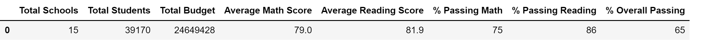

##### After:
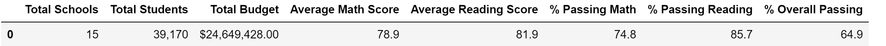

### How is the school summary affected?
The results for Thomas High School changed significantly as follows (other schools were not affected).

- The pass percentage for Math dropped from 93.27% to 66.91%.
- The pass percentage for Reading dropped from 97.31% to 69.66%
- Overall pass percentage dropped from 90.95% to 68.08% 

#### Before:
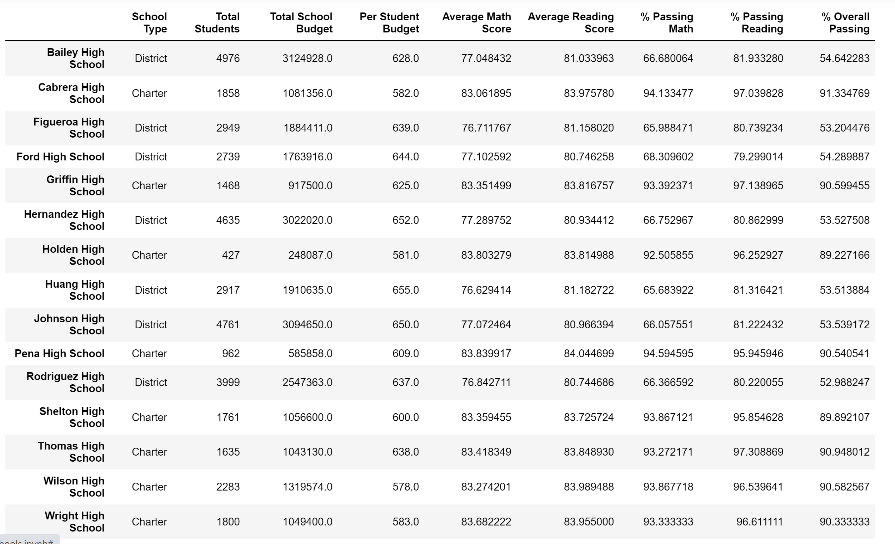

#### After:

### How does replacing the ninth graders’ math and reading scores affect Thomas High School’s performance relative to the other schools?

The table below shows the scores after replacing the ninth graders' Math and Reading scores. The performance of Thomas High School relative to others changes as follows:

- Thomas High School ranked 2nd in Overall Pass Percentage (at 90.630324%), with Cabrera High School ranked highest at 91.334769% and Giffin High School ranked 3rd at 90.599455% (no change in position).
- Thomas High School ranked 7th in Maths with 93.18569% (no change in position)
- Thomas High School dropped from 1st to 3rd position in Reading Pass Percentage (dropped from 97.308869% to 97.018739%).

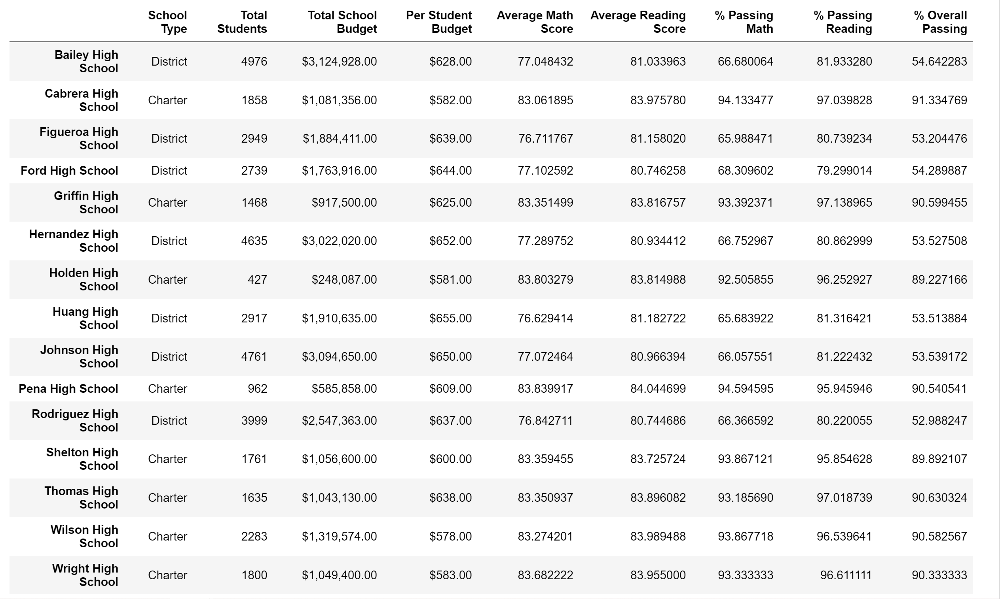

### How does replacing the ninth-grade scores affect the following:

### Math and reading scores by grade

#### Math Scores by grade

The table below shows the replacement of ninth grade Math scores.

Before:
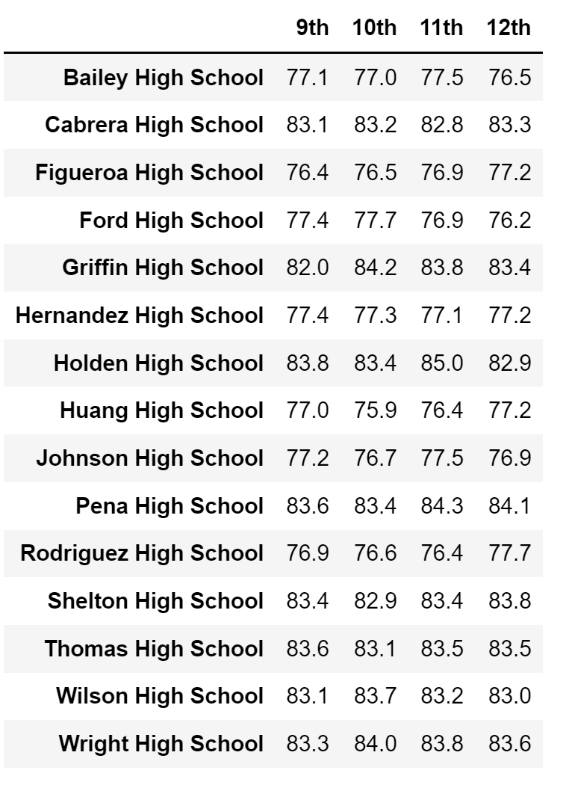

After:
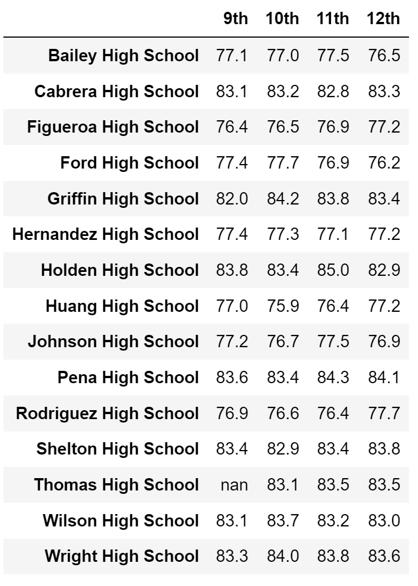

#### Reading Scores by grade

The table below shows the replacement of ninth grade reading scores.
Before:

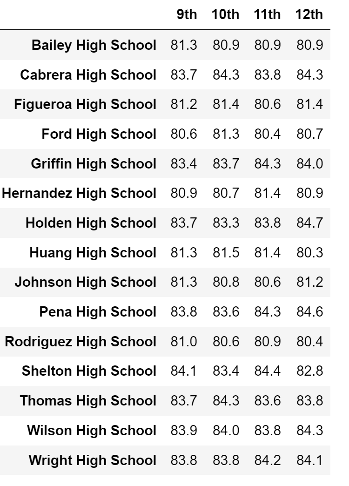

After:

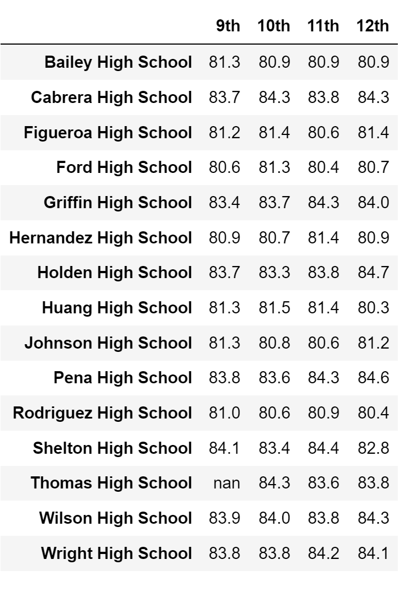

### Scores by school spending

The figures below illustrate the scores by school spending.

Before:
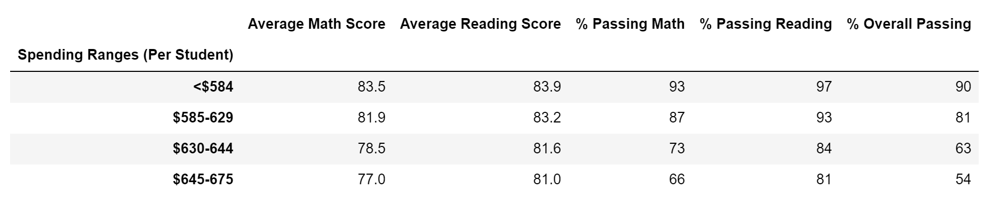

After:
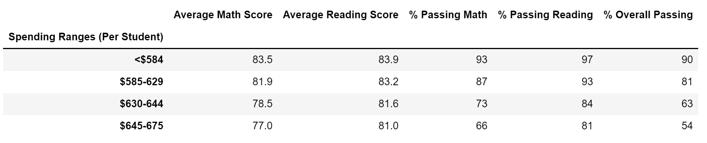

### Scores by school size

The figures below illustrate the scores by school size.

Before:
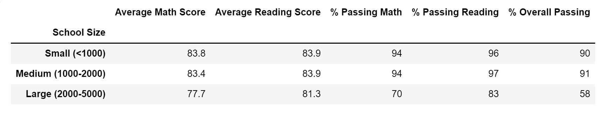

After:
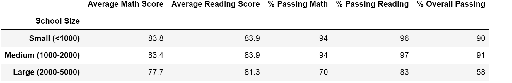

### Scores by school type

The figures below illustrate the scores by school type.

Before:
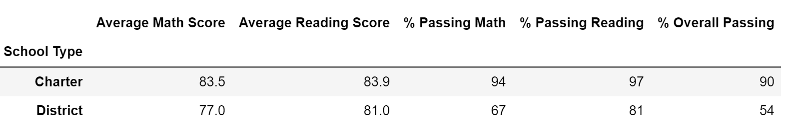

After:
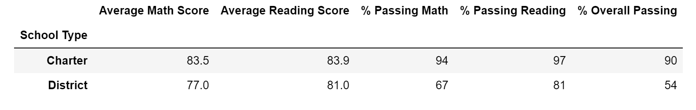

## Summary

Following are the four changes in the updated school district analysis after reading and math scores for the ninth grade at Thomas High School have been replaced with NaNs.

- Thomas High School dropped from 1st to 3rd position in Reading Pass Percentage (dropped from 97.308869% to 97.018739%).
- Average Math Score dropped from 79.0% to 78.9%
- Percentage passing reading dropped from 86 to 85.7%
- Overall Pass percentage dropped from 65% to 64.9%